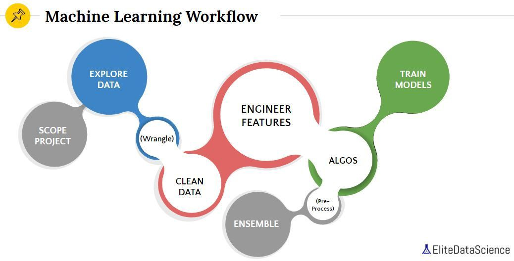

# Introduction

The workflow of a Machine learning project. Best practices involved with developing a Machine Learning pipeline. 

[latest online version](https://suredream.github.io/geoml-guide/)

# Workflow

## Defining the problem
This is the most crucial step in any machine learning project. We need to understand what the problem is asking for. Define what you want to predict. Describe the output of your model in detail. Check is it even possible to make predictions using a single model or not. If not, break the task into sub-tasks that are easier to understand and learn. Sub-tasks usually consist of those attributes which are essential for making the final decision. The outputs from these sub-tasks are then combined to make the final decision. Decomposing the tasks may require you to re-formulate the problem statement.

## Tasks

.. include:: ../action-guide.md